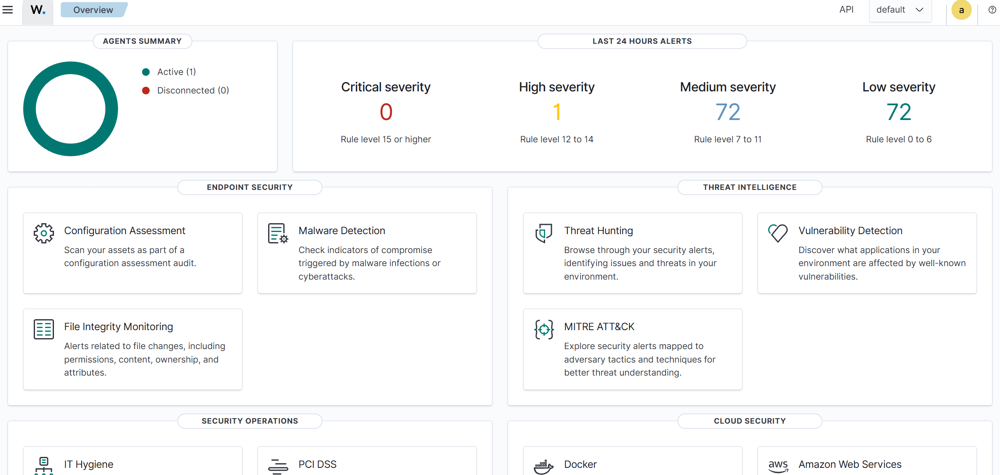
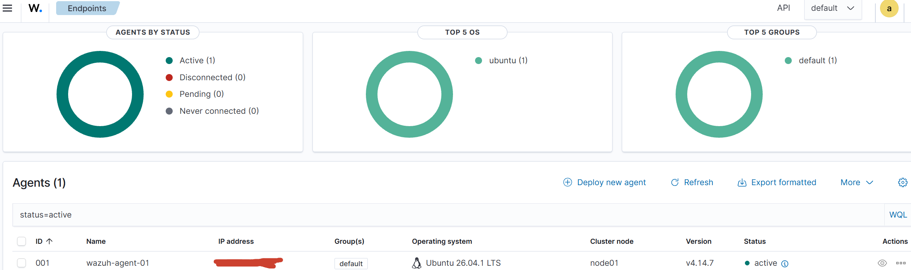
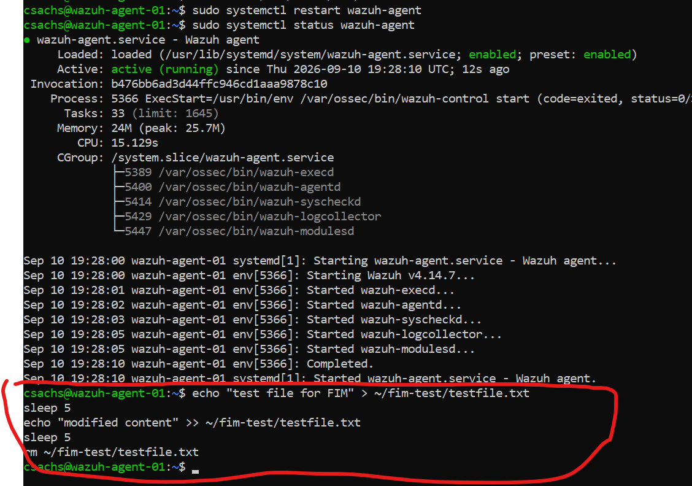
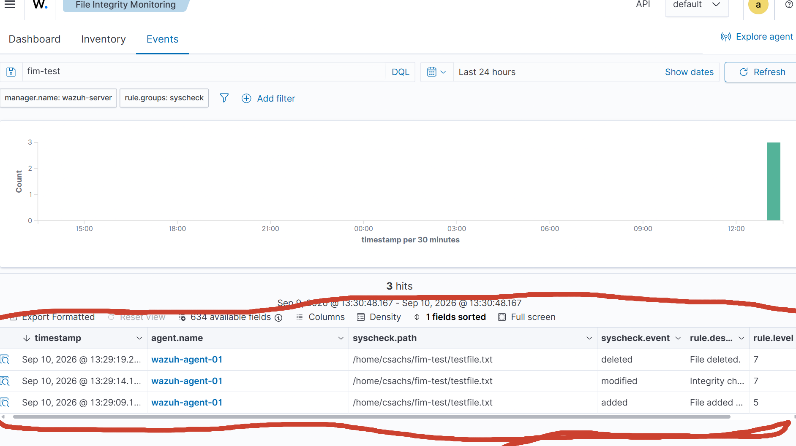

# Lab 01: Wazuh SIEM Deployment

## Objective
Deploy a self-hosted Wazuh SIEM (manager + agent) in a VirtualBox lab
environment, configure File Integrity Monitoring (FIM) on a custom
directory, and validate detection end to end. Builds toward SOC
Analyst / Cloud Security Engineer roles, supports Security+ study.

## Environment
- VirtualBox (Windows host)
- Wazuh manager: deployed via official Wazuh OVA
- Wazuh agent: fresh Ubuntu Server 24.04 LTS install
- Both VMs on a Bridged network adapter

## What I Built

### Manager deployment
- Imported the Wazuh OVA into VirtualBox
- Changed both default credentials immediately after first boot:
  - `wazuh-user` system/SSH login (via `passwd`)
  - Dashboard `admin` login (via `wazuh-passwords-tool.sh`)
- Verified dashboard access at `https://<manager-IP>`

### Agent deployment
- Built a fresh Ubuntu Server 24.04 VM as the monitored endpoint
- Installed the Wazuh agent using the install command generated by the
  dashboard's "Deploy new agent" wizard (ensures correct package
  version and manager IP are set automatically, rather than relying on
  a possibly outdated command from documentation/forums)
- Started and enabled the `wazuh-agent` service
- Confirmed the agent registered and showed **Active** in the
  dashboard's Agents view

### File Integrity Monitoring (FIM)
- Created a test directory (`~/fim-test`) on the agent VM
- Edited `/var/ossec/etc/ossec.conf` (root-owned, required `sudo`) to
  add the test directory to the `<syscheck>` block with real-time
  monitoring enabled
- Restarted the `wazuh-agent` service to apply the config change
- Generated test events: created, modified, and deleted a file inside
  the monitored directory
- Confirmed corresponding alerts appeared in the Wazuh dashboard

## Troubleshooting

This lab involved more infrastructure troubleshooting than initially
expected, arguably the most valuable part of the exercise:

**VirtualBox clipboard sharing failure**
Enabling Guest Additions and setting Bidirectional clipboard sharing
did not reliably allow copy/paste into the VM console. Worked around
this by SSHing into the VM from a terminal on the host machine
instead, which uses normal OS-level clipboard behavior with no
VirtualBox configuration required. Adopted this as the standard
approach for all subsequent VM work in this lab.

**Ubuntu Server installer soft lockup**
The installer hung indefinitely during the "installing kernel" step,
with the console showing `watchdog: BUG: soft lockup - CPU#0 stuck`.
Root cause was a conflict between VirtualBox and Windows'
Hyper-V-based virtualization features running on the host. Resolved by:
- Disabling Windows Sandbox, Virtual Machine Platform, and Windows
  Hypervisor Platform (Windows Features)
- Disabling Memory Integrity (Core Isolation) in Windows Security
- Confirming VT-x was enabled at the BIOS level
- Reducing the VM to 1 CPU core and disabling I/O APIC as an
  additional stability measure

**PXE/DDIM boot error after installation**
After completing the install and ejecting the ISO, the VM failed to
boot with `Option ROM requires DDIM support`, a PXE (network boot)
error. This indicated the VM's boot order still had Network ranked
above Hard Disk, so it was attempting to network boot instead of
booting the newly installed OS. Fixed by removing Network from the
boot order and confirming Hard Disk was set as the boot priority.

**Config file permissions**
`/var/ossec/etc/ossec.conf` is root-owned; direct edits require
`sudo` with a terminal editor (used `nano`) rather than a standard
user-level text editor.

## Validation
- Agent status confirmed **Active** in the Wazuh dashboard
- FIM alerts confirmed for file creation, modification, and deletion
  events on the monitored test directory

## Screenshots
*(add screenshots here)*

## Key Takeaway
A working SIEM pipeline is only half the lab, the other half is the
infrastructure troubleshooting required to get there: diagnosing a
host-level virtualization conflict, correcting a VM boot order issue,
and working around tooling limitations (clipboard sharing) rather than
getting stuck on them. This mirrors real SOC/sysadmin work more
closely than a clean, uninterrupted setup would have.