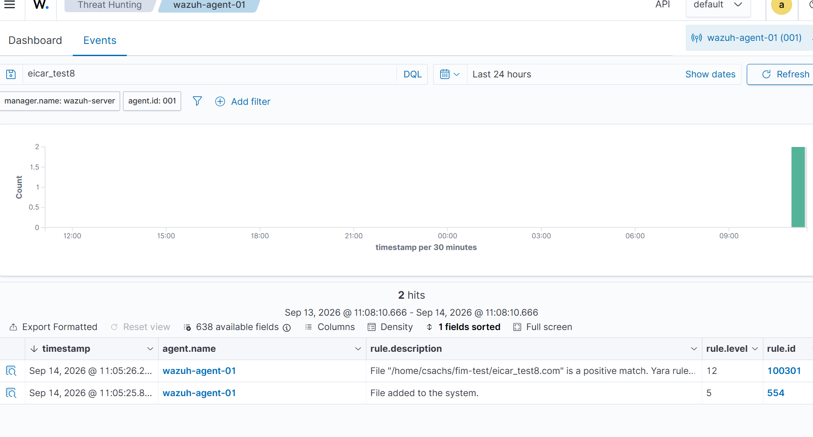
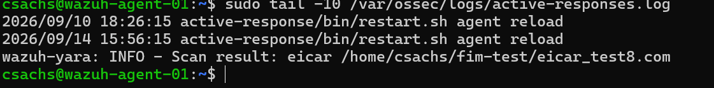

# Lab 02: YARA Malware Detection via Active Response

## Objective
Extend the existing Wazuh SIEM deployment with automated malware
detection: whenever File Integrity Monitoring detects a new file, an
Active Response automatically triggers a YARA scan of that file, and
a positive match generates a dedicated alert. Builds directly on
[Lab 01: Wazuh SIEM Deployment](../01-wazuh-siem/README.md).

## What I Built
- Installed YARA on the agent VM
- Pulled a public YARA ruleset designed to detect the EICAR test file
  (a safe, industry-standard file for testing detection tooling)
- Wrote a custom Active Response script (`yara.sh`) that receives a
  FIM event, extracts the affected file path, and runs a YARA scan
  against it
- Configured the Wazuh manager to:
  - Define the `yara` command
  - Trigger that command via Active Response whenever rule `554`
    ("File added to the system") fires
  - Decode and alert on the YARA scan's output via a custom decoder
    and two custom rules (`100300`, `100301`)
- Validated the full chain using the EICAR test file: FIM detects the
  new file (rule 554) → Active Response runs YARA → YARA flags the
  file → Wazuh generates a dedicated alert (rule 100301, level 12)

## Troubleshooting

This was a substantially harder lab than the FIM setup alone, and
involved real systematic debugging across multiple layers of the
Wazuh architecture:

**Config block nesting error**
Initially placed the `<command>` and `<active-response>` blocks inside
the existing `<ossec_config>` block instead of as a separate sibling
block, causing the manager to fail to start with an "Invalid element
in the configuration" error. Fixed by ensuring the new block was its
own top-level `<ossec_config>...</ossec_config>` section.

**Working on the wrong VM**
Spent significant time troubleshooting `local_rules.xml` and the
active-response configuration while accidentally SSH'd into the
**agent**, not the **manager**. The ruleset, custom rules, decoders,
and active-response definitions all live on the manager; the agent
only needs the executable script itself. Confirmed via `hostname` and
re-ran all manager-side checks on the correct machine.

**No visibility into whether the active response ever fired**
`active-responses.log` and `ossec.log` showed no evidence of dispatch
at first, with no errors either, making this the hardest part to
diagnose. Resolved by enabling debug logging on both `wazuh-execd` and
`wazuh-analysisd` (`execd.debug=1` and `analysisd.debug=2` in
`local_internal_options.conf`), which revealed:
- `analysisd` genuinely was matching rule 554 and dispatching the
  command (`Send AR to execd: yara0`)
- Since Active Response `<location>local</location>` means the script
  runs **on the agent that generated the event**, not the manager,
  the actual execution and any script-level issues were only visible
  in the agent's own logs, not the manager's

**Root cause: JSON field mismatch in the Active Response script**
Once execution was confirmed on the agent side, the script still
produced no YARA output. The script's filename extraction used:
```bash
grep -o '"syscheck.path":"[^"]*"'
```
assuming a flat key named `syscheck.path`. The actual JSON Wazuh
passes to Active Response scripts nests the field instead:
```json
"syscheck":{"path":"/home/csachs/fim-test/eicar_test7.com", ...}
```
The flat-key pattern never matched, so `FILENAME` was always empty,
causing YARA to scan nothing, silently, with no error, exit code, or
log entry. This is a difficult class of bug: the entire pipeline
(rule matching, dispatch, script execution) was working correctly,
only the data extraction inside the script itself was wrong. Fixed
by correcting the extraction logic to match the actual nested JSON
key:
```bash
grep -o '"path":"[^"]*"' | head -1 | cut -d'"' -f4
```

## Validation
- Confirmed via the manager's alert log that rule 554 fires for a new
  test file, followed immediately by rule 100301 ("File ... is a
  positive match. Yara rule: eicar"), level 12
- Confirmed in the Wazuh dashboard (Threat Hunting → Events) with both
  rule IDs appearing in sequence for the same file event

## Screenshots
*(add screenshots here)*



## Key Takeaway
The bug here wasn't in configuration syntax or a missing step, it was
a silent data-format mismatch buried inside a working pipeline, the
kind of issue that doesn't throw an error and can't be found by
re-reading documentation. Finding it required deliberately increasing
observability at each stage (manager rule-matching, dispatch, then
agent-side execution) rather than guessing at fixes, and correctly
identifying which machine each log and config file actually lives on.
This mirrors real incident/troubleshooting work more closely than any
other lab so far: the fix was small, but getting there required a
structured, layer-by-layer process of elimination.